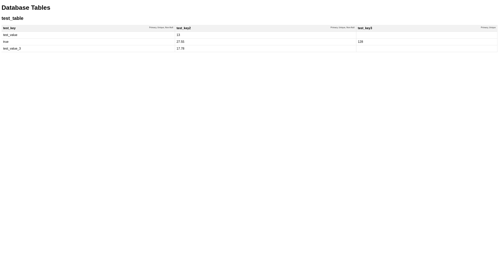

# Rust Database

Rust Database is a Rust-based project designed to emulate a MySQL-like database system. It includes:

- **core**: A library providing fundamental database functionality for use in other projects.
- **server**: An executable that exposes API endpoints (e.g., HTTP) to interact with the database, acting as a full-fledged database management system.
- **client**: An example implementation showcasing how to interact with the database as a library.

## Capabilities

The Rust Database system provides the following capabilities:

- **Table Management**: Create, drop, and rename tables.
- **Column Management**: Insert columns into tables with various constraints (primary key, non-null, unique).
- **Row Management**: Insert rows into tables.
- **Querying**: Select rows from tables with optional conditions.
- **Updating**: Update rows in tables based on conditions.

*Note: Currently, primary key, foreign key, and unique constraints do not affect query results or update operations.*

## Supported Data Types

The following data types are currently supported:

- String
- Int
- Float
- Boolean
- Null

## Getting Started

### Running the Server

To start the server locally:

 ```bash
 cargo run --package client --bin client
 ```

Access the server at [http://localhost:3000](http://localhost:3000).

### Running the Client

The client's binary code serves as a reference implementation and can be started using:

 ```bash
 cargo run --package client --bin client"
```

### Docker/Podman Usage

To run the server using Docker or Podman, use docker-compose or podman-compose:

 ```bash
docker-compose up
```
or

 ```bash
podman-compose up
```

To stop and restart the server with a fresh build, use the following command:

 ```bash
podman-compose up --force-recreate
```

This command stops any existing containers, removes them, and then starts new containers from the latest build.

To remove the server container:

 ```bash
docker-compose rm -s -f
```
or

 ```bash
podman-compose down -v --remove-orphans
```

### Screenshots



## Documentation

For detailed documentation:

- **core**: "cargo doc --open --package core"
- **server**: "cargo doc --open --package server"
- **client**: "cargo doc --open --package client"

## REST API Endpoints

The server exposes the following API endpoints:

- `/create`: Create a new table.
- `/drop_table`: Drop a table.
- `/insert_column`: Insert a column into a table.
- `/insert_row`: Insert a row into a table.
- `/select`: Select rows from a table with optional conditions.
- `/update_table`: Update rows in a table based on conditions.
- `/rename_table`: Rename a table.

Please refer to the client code for example usage of these endpoints.
